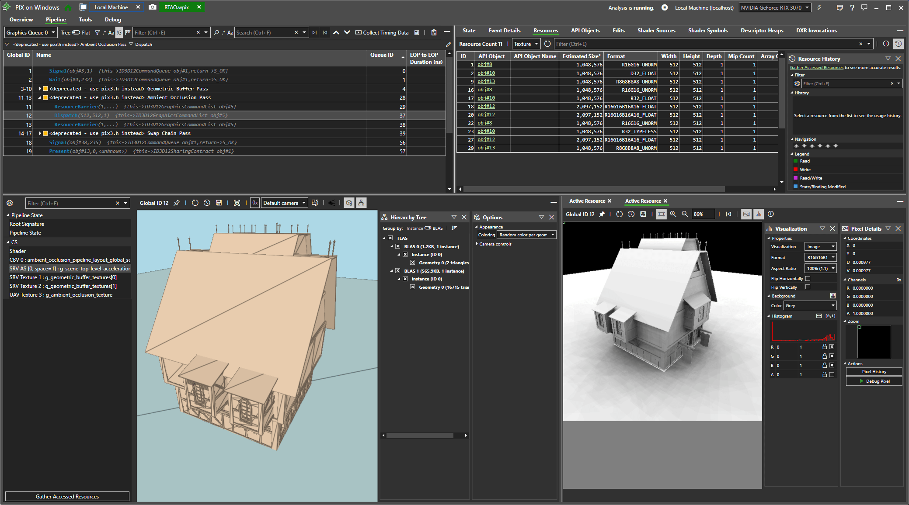
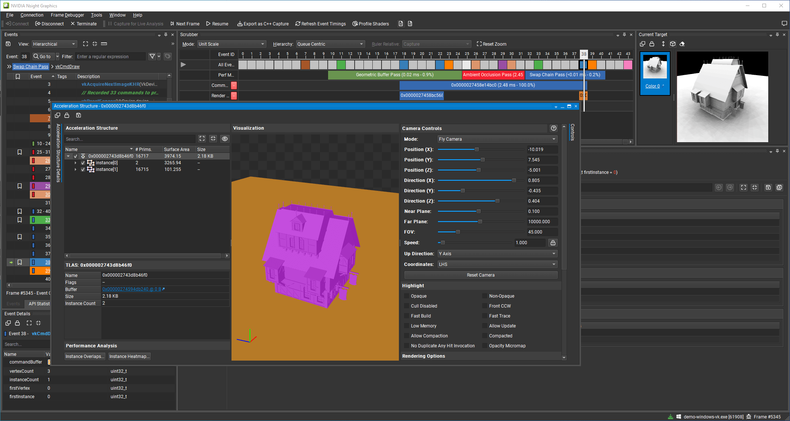
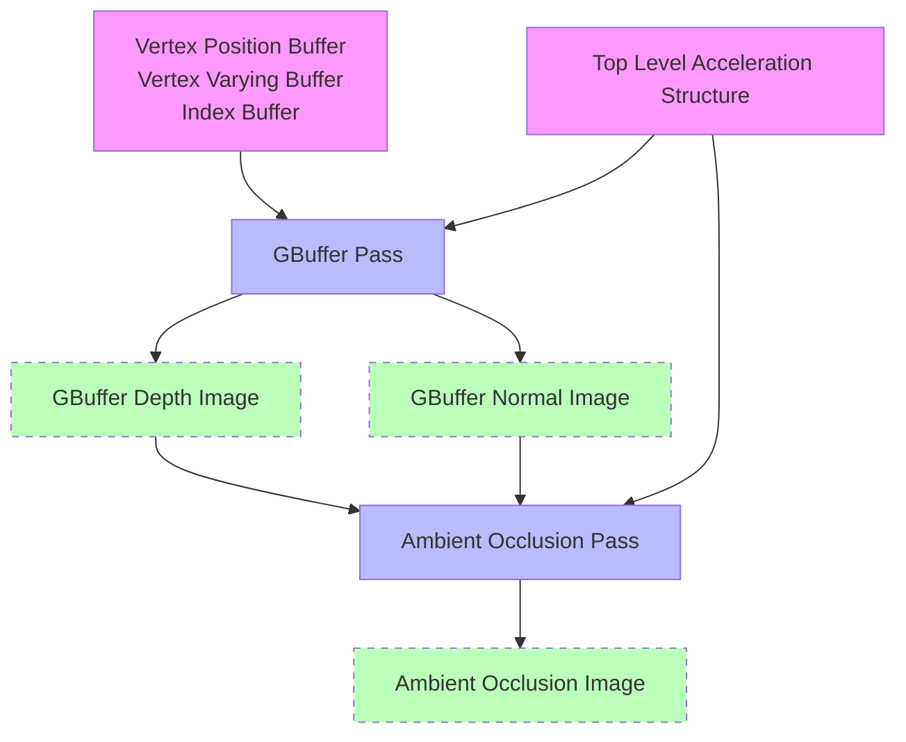

## RTAO (Ray Traced Ambient Occlusion)  

  

  

  

  

```mermaid  
graph TD
    classDef Asset fill:#f9f;
    classDef Render_Pass fill:#bbf,shape:parallelogram;
    classDef Intermediate fill:#bfb,stroke-dasharray: 5 5;

    Geometry_Buffers[Vertex Position Buffer<br> Vertex Varying Buffer<br> Index Buffer]:::Asset
    Acceleration_Structure[Top Level Acceleration Structure]:::Asset
    GBuffer_Pass[GBuffer Pass]:::Render_Pass
    AO_Pass[Ambient Occlusion Pass]:::Render_Pass
    GBuffer_Depth[GBuffer Depth Image]:::Intermediate
    GBuffer_Normal[GBuffer Normal Image]:::Intermediate
    AO[Ambient Occlusion Image]:::Intermediate

    Geometry_Buffers --> GBuffer_Pass
    Acceleration_Structure --> GBuffer_Pass
    GBuffer_Pass --> GBuffer_Depth
    GBuffer_Pass --> GBuffer_Normal
    GBuffer_Depth --> AO_Pass
    GBuffer_Normal --> AO_Pass
    Acceleration_Structure --> AO_Pass
    AO_Pass --> AO
```